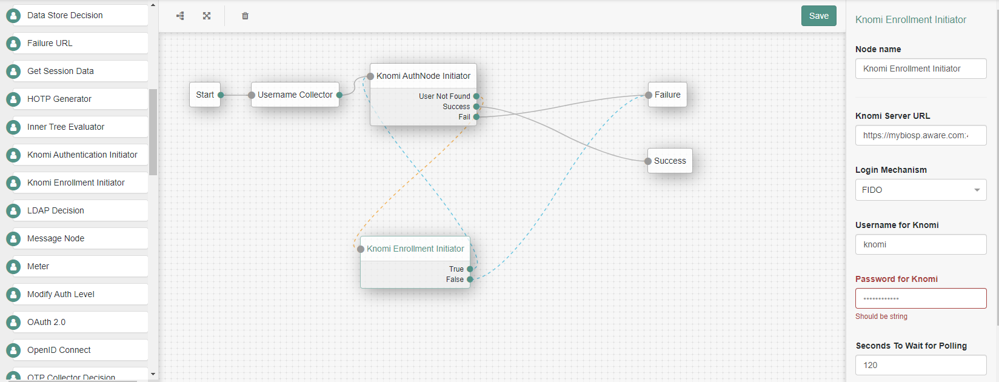
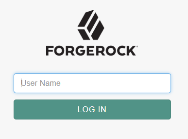
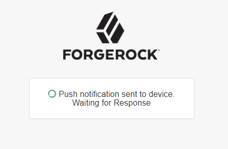
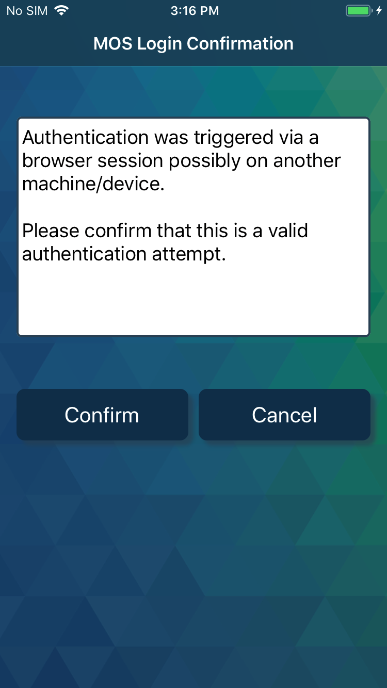
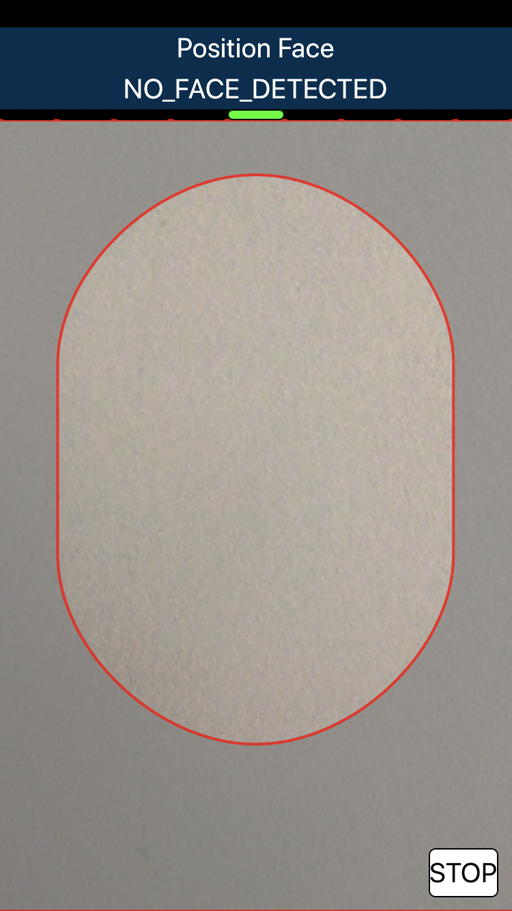
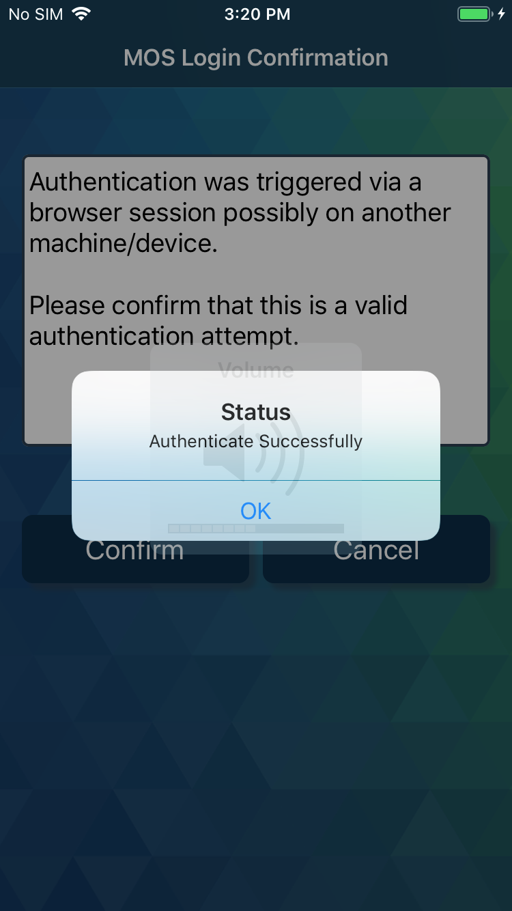
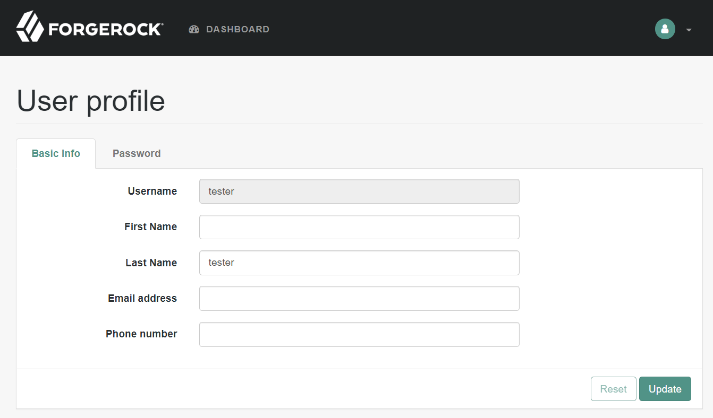
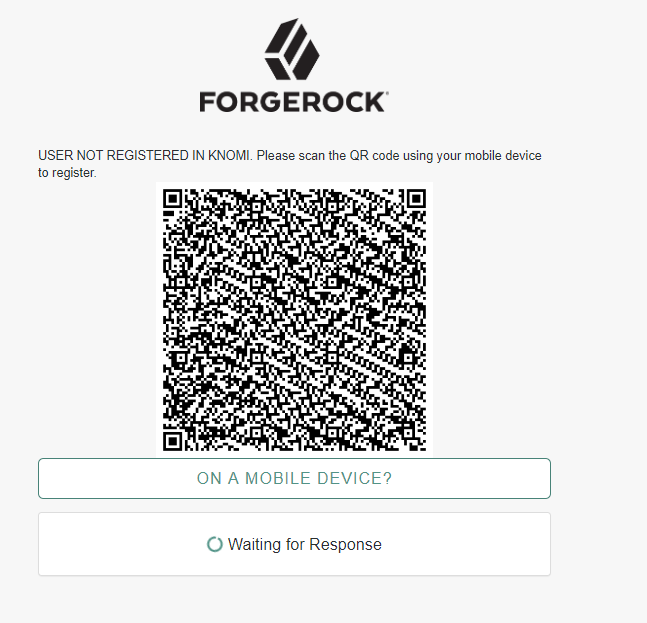

# Aware Knomi Authentication Node for Forgerock OpenAM

Aware’s Knomi® platform enables secure and convenient password-free authentication using face and voice biometrics. Forgerock customers can install the Aware Knomi Authentication Node to incorporate world-class, spoof-resistant biometrics to their authentication trees.

## About Aware
Aware (www.aware.com) is a leading global provider of software products and solutions for biometric identification and authentication. Aware’s products include complete biometric software solutions as well as the modular components used to build them: SDKs and applications for enrollment; fingerprint, face, iris, and voice matching algorithms; mobile biometric capture and authentication software; a biometric workflow and middleware platform, and a fully-scalable ABIS. These products fulfill critical biometric functionality for applications in financial services, enterprise security, healthcare, human resources, citizen ID, border management, law enforcement, defense, and intelligence. Learn more about Aware on [Twitter](https://twitter.com/AwareBiometrics) and [LinkedIn](https://www.linkedin.com/company/aware-inc.).

## Installation

Copy *knomiAuthNode-X.jar* into openam deployment directory:
*../web-container/webapps/openam/WEB-INF/lib*

## Authentication Nodes Description

### Knomi Enrollment Initiator Node
This node triggers an enrollment of the user at Knomi if the user is not yet registered. This node returns a Success
 if the enrollment is successful, otherwise it returns a failure. 

#### Configuration Parameters
The different configuration parameters and their default values are given below:
 - Knomi Server URL. This is the URL where the Knomi server is located. value: e.g. https://hostname:portNo/BioSP
 - Login Mechanism. The method login uses, currently supports:
	 - MOS: Match-On-Server. User's facial images will be sent to Knomi server for authentication.
	 - FIDO: Fast IDentity Online. User's facial images will not leave the mobile device by following FIDO protocol.
 - Username. Credentials required to communicate with Knomi Server. 
 - Password. Credentials required to communicate with Knomi Server. 
 - Seconds to Wait for Polling. Polling interval seconds to update results from Knomi Server. value: e.g. 1
 - Max.no of times to Poll. Maximum number of times to poll. value: e.g. 2000

### Knomi AuthNode Initiator Node
This node triggers an authentication workflow. This node returns three different outcomes: User Not Found, Success or
Failure. If the outcome User Not Found is returned, the Knomi Enrollment Initiator should be the next node in the
tree to trigger an enrollment.

#### Configuration Parameters
The different configuration parameters and their default values are given below:
 - Knomi Server URL. This is the URL where the Knomi server is located. value: e.g. https://hostname:portNo/BioSP
 - Login Mechanism. The method login uses, currently supports:
	 - MOS: Match-On-Server. User's facial images will be sent to Knomi server for authentication.
	 - FIDO: Fast IDentity Online. User's facial images will not leave the mobile device by following FIDO protocol.
 - Notification Method. The method Knomi server uses to communicate with mobile device, currently supports:
    - PUSH_NOTIFICATION: sending a push notification to mobile device.
    - QR_CODE: using mobile device to scan a QR Code.
 - Username. Credentials required to communicate with Knomi Server.
 - Password. Credentials required to communicate with Knomi Server.
 - Seconds to Wait for Polling. Polling interval seconds to update results from Knomi Server. value: e.g. 1
 - Max.no of times to Poll. Maximum number of times to poll. value: e.g. 2000

The diagram below indicates how the different authentication nodes can be built as a tree to trigger an out-of-band authentication process.

### Authentication workflow
The authentication workflow starts at the Forgerock login page. User should enter the username and click log in.

#### If user has registered previously 
If this username has been registered previously, the authentication workflow will be triggered. A push notification will be sent to the mobile phone that was used to register this user. The browser will display the waiting page.

On mobile side, a confirm login button is displayed. Click the button and follow the face capture to proceed. If the login is successful, a success alert will pop up on phone.

  

After user successfully completed the mobile face validation, the browser will automatically display the page after log in.

#### If user is a new user
If this username has not been registered previously, the enrollment workflow will be triggered before authentication workflow is triggered.

### Enrollment workflow
After user inputs the username in login page, and this username is not registered before, a QR Code will be displayed in browser.

User needs to use the mobile app to scan this QR Code to trigger the registration from mobile phone. After it is done, the authentication flow will be triggered automatically. A push notification will be sent to mobile phone for authentication.
